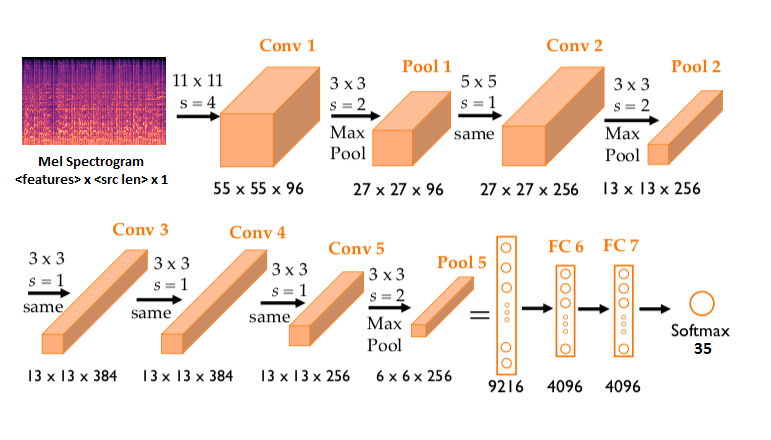

# Audio Classification

## Datasets
- Speech Commands from `torchaudio`, with `35` class.

## Model Architecture
- Using AlexNet with Mel Spectrogram `1` channel.
- Output is a softmax with `35` nodes (`35` class).

## How to use this respository?
- Edit your configuration in `conf/configs.yaml`
- Train model using `python main.py -cp conf -cn configs`

## Additional
- You guys should install `PySoundFile` on windows or `sox` on linux, for torchaudio I/O backend.